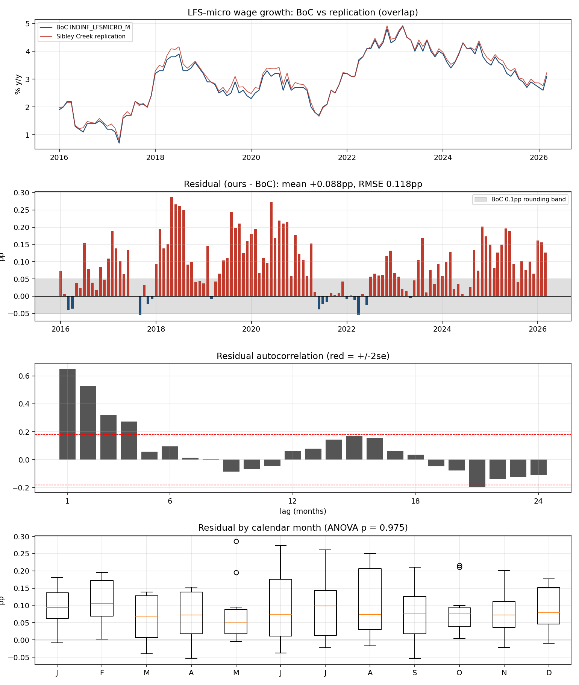
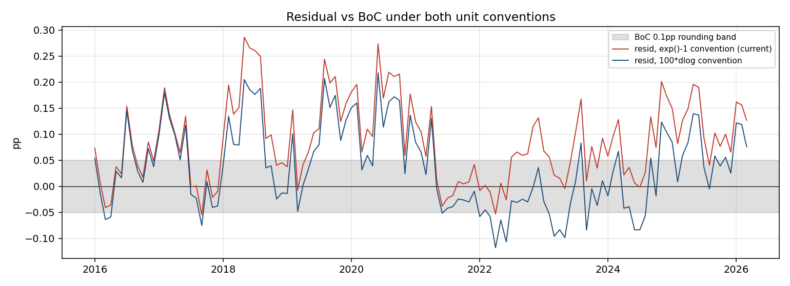
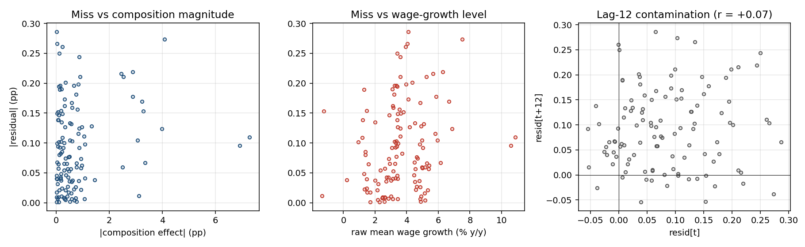

# LFS-micro replication: residual forensics vs BoC INDINF_LFSMICRO_M

Date: 2026-06-09. Branch `lfs-micro`. Read-only analysis; all scratch outputs in
`forensics/` (scripts: `residual_forensics.py`, `bias_origin.py`,
`lp_convention_check.py`, `perturbation_floor.py`).

Inputs:
- BoC: `data/raw/lfs_micro.csv` (Valet INDINF_LFSMICRO_M, fetched 2026-06-05,
  2000-01..2026-03, published to ONE decimal place — every value sits on the
  0.1pp grid).
- Ours: `data/processed/lfs_micro_replication.csv`, `underlying_pct`
  (raw/unsmoothed spec, exp()−1 conversion), 2016-01..2026-05.

## 1. Alignment and headline fit — claims CONFIRMED

Both series use reference-month dating (first-of-month). A ±3-month alignment
scan puts the fit minimum decisively at lag 0 (RMSE 0.118 at k=0 vs 0.30–0.32 at
k=±1) — no off-by-one corruption.

Recomputed on the 123-month overlap (2016-01..2026-03):

| metric | claimed | recomputed |
|---|---|---|
| RMSE | 0.118pp | **0.1178pp** |
| corr | 0.9966 | **0.9966** |
| max miss | 0.29pp | **0.2863pp** (2018-05; ours 4.086 vs BoC 3.8) |
| n | 123 | **123** |

## 2. Residual character (ours − BoC): not noise — a level offset plus slow wander

- **Mean +0.0878pp, t = 12.3.** We sit systematically ABOVE the BoC. The bias
  alone is 55.5% of the mean-squared error. This is the single biggest fact
  about the residual.
- **Persistent:** ACF 0.65 / 0.53 / 0.32 at lags 1/2/3, dead by lag 6. The
  rolling 12-month mean wanders between −0.04 (2022-23) and +0.16 (2018, 2020).
- **No trend** (slope +0.0005pp/yr, p=0.85), **no seasonality** (by-calendar-month
  ANOVA p=0.97 — no base-period or seasonal-composition artifact), normal
  distribution (KS p=0.53), regression slope of ours on BoC = 1.0044 (no
  attenuation/amplification).
- Worst months: 2018-05/06/07/08 (+0.25..0.29), 2020-06..10 (+0.21..0.27,
  the COVID composition-swing months), 2019-08/10.

## 3. The bias is mostly a UNITS convention difference (fixable)

We convert log-points to percent via exp()−1. If the BoC publishes 100×Δlog
(standard in staff-note wage decompositions), our convexity term
(pct − 100·lp, mean **+0.0507pp**, growing with the wage-growth level) is a
pure artifact. Test — recompare using our own series as 100×Δlog:

| convention | RMSE | bias | resid sd | corr(resid, wage level) |
|---|---|---|---|---|
| exp()−1 (current) | 0.1178 | +0.0878 | 0.0789 | +0.24 (p=0.008) |
| 100×Δlog | **0.0885** | **+0.0371** | 0.0807 | **+0.02 (p=0.81)** |

Three independent signatures all flip the right way: RMSE drops 25%, the bias
drops by almost exactly the mean convexity term, and the residual's correlation
with the wage-growth level vanishes (it was the convexity, which scales with
level²). Max miss falls 0.286 → 0.218pp. Conclusion: **the BoC series is, with
high confidence, published in log points (×100), not exp()−1 percent.**
This is the one concrete spec difference found, and it is fixable in one line
(compare/report `underlying_lp*100`; or keep exp()−1 for our own readers but
calibrate against BoC in lp units).

## 4. Hypothesis tests on the remaining gap

**(a) PUMF wage top-coding/rounding — REJECTED.** The PUMF codebook shows
HRLYEARN exact to the cent, max $250 hit once, no ceiling mass. In-memory
perturbation re-runs of `_compute_one_yoy` (8 stratified month-pairs, no cache
writes): rounding all wages to the nearest $0.50 moves underlying by sd
0.012pp (max 0.021); to the nearest $1.00, sd 0.021pp; top-coding at the 99th
percentile, sd 0.027pp. Even degradations far harsher than anything in the
PUMF move the estimate an order of magnitude less than the residual. Wage
precision is not the gap.

**(b) Thin-category pruning — REJECTED as a material driver.** The engine does
not persist per-month pruning logs (log-only at INFO), so proxies were used:
min(n_obs), R². |resid| is *positively* (weakly) related to sample size
(Spearman +0.18) — the opposite sign to a pruning story — and unrelated to R²
(+0.05). The 2026-06-05 union-vs-intersection sensitivity run already bounded
the thin-category rule at 0.003pp max effect.

**(c) Y/y year-pair contamination — REJECTED.** corr(resid[t], resid[t+12]) =
+0.066 (p=0.49); ACF at lag 12 = +0.06, inside the ±0.18 band. After the
2026-06-05 parquet repairs, no remaining single bad PUMF month is flipping sign
12 months later. (This test would have lit up bright red before those fixes.)

**(d) Composition-adjustment magnitude — SUPPORTED.** Signed composition effect
correlates with the residual (+0.23, p=0.01; still +0.19 under lp convention),
and the worst non-2018 misses are exactly the giant-composition COVID months
(2020-06: composition +4.1pp). The perturbation experiment pins the mechanism:
coarsening occupation detail one notch (43→9 groups) shifts underlying by
**mean +0.049pp, sd 0.156, max 0.279**, with the composition term moving
mirror-image (−0.046); coarsening occupation+industry: mean +0.077, sd 0.21.
Granularity of the category set is the dominant sensitivity in the whole
engine — 10× the wage-precision lever.

## 5. The irreducible floor

The Bank computes on confidential master files: finer occupation (4-digit NOC,
~500 unit groups vs our 43), exact age (vs 5-year bins), exact tenure (vs 5
bins, top-capped at 240m), exact weights. The coarsening gradient runs in
exactly the direction of our remaining bias: **coarser categories → less wage
growth attributed to composition → higher "underlying."** Our PUMF category set
is one-to-two notches coarser than the master file, and the observed remaining
bias (+0.037pp under lp units) and slow wander (persistent component sd
~0.05pp) are both comfortably inside the measured per-notch gradient
(+0.05..0.08 mean, 0.16-0.21 sd). The 2018 and 2020 residual bulges are what a
granularity gap looks like when composition is moving fast.

Floor arithmetic (lp convention, MSE = 0.00783pp²):
- BoC 0.1pp publication rounding: variance 0.1²/12 = 0.00083pp² (RMSE-equivalent
  0.029pp) — hard floor, present in any comparison against the Valet feed.
- Granularity bias² (0.0371²) = 0.00138pp².
- Persistent wander (AR1 0.66 ⇒ ρ² ≈ 44% of de-meaned variance) ≈ 0.00286pp² —
  same granularity/spec family, co-moving with composition cycles.
- White remainder ≈ 0.00276pp² (≈0.053pp RMSE-equivalent) — estimation noise
  from weights/sample/spec micro-differences; unbiased and serially
  uncorrelated.

After the units fix, RMSE 0.0885pp ≈ the practical PUMF floor. Without master
file access there is no credible path materially below ~0.08pp; anything under
0.029pp is impossible against a 1-decimal published series.

## 6. Verdict: decomposition of the 0.118pp RMSE (MSE shares of 0.0139pp²)

| component | MSE share | RMSE if only this remained | class |
|---|---|---|---|
| exp()−1 vs 100×Δlog convexity | **43.6%** | 0.078pp | **explained-FIXABLE** (one line: compare in lp units) |
| Category-granularity bias + wander (PUMF coarser than master files) | **30.5%** | 0.065pp | explained-IRREDUCIBLE (with PUMF) |
| BoC 0.1pp publication rounding | **6.0%** | 0.029pp | explained-IRREDUCIBLE (hard floor) |
| White estimation noise (weights/sample micro-diffs) | **19.9%** | 0.053pp | unexplained-but-bounded (white, unbiased, no testable structure left) |

Fixing the units convention takes the headline fit from RMSE 0.1178 / bias
+0.088 to **RMSE 0.0885 / bias +0.037**, at which point the replication is at
its public-data floor: the remaining gap carries the exact fingerprint of the
master files' finer category detail (sign, size, and composition co-movement
all match), plus publication rounding and white noise.

### Recommended action
1. Add an lp-units benchmark line to `calibrate.py` / the calibration report
   (compare `underlying_lp*100` against Valet; keep exp()−1 for reader-facing
   output if desired, but state the convention).
2. Optionally persist per-month pruned-category lists from
   `_apply_common_column_pruning` into the engine cache for future audits
   (currently log-only) — diagnostic nicety, not a fit issue.
3. No change to the engine spec: hypotheses (a)-(c) are dead; (d) is real but
   unfixable on public data.
